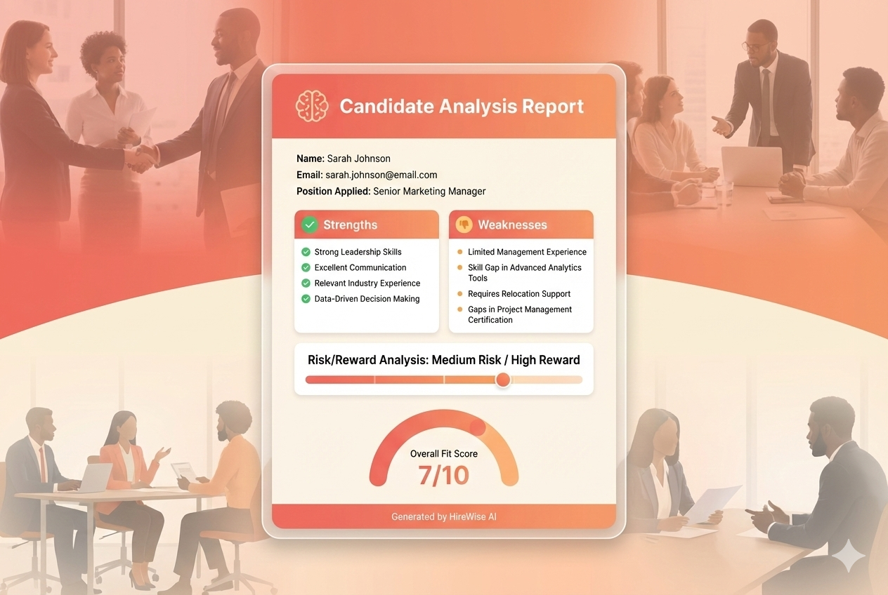
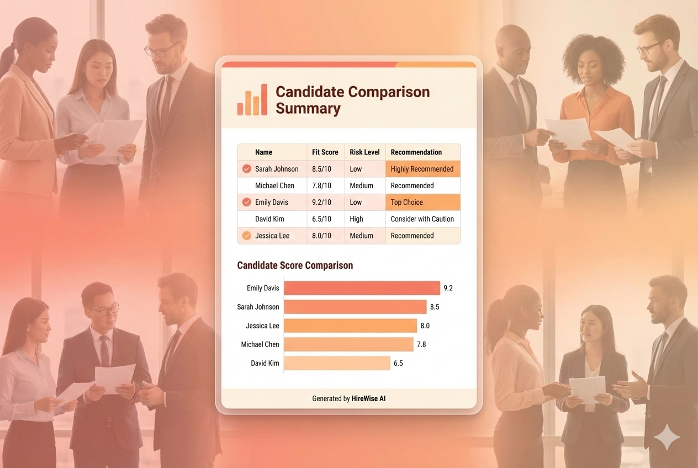

> AI-Powered Resume Analysis & Candidate Screening — Make smarter hiring decisions with intelligent automation.


---

## 🎯 What It Does

Upload resumes and job descriptions — get comprehensive candidate evaluations with strengths, weaknesses, risk/reward analysis, and fit scores. All results are automatically saved to Google Drive and logged to Google Sheets for easy tracking.

**Perfect for:**
- HR teams screening multiple candidates
- Recruiters needing quick, consistent evaluations
- Hiring managers making data-driven decisions
- Startups building structured hiring processes

---

## ✨ Key Features

| Feature | Description |
|---------|-------------|
| **Multi-Format Support** | Handles both PDF and DOC/DOCX resume formats |
| **Structured Analysis** | Extracts candidate info, strengths, weaknesses, and qualifications |
| **Risk/Reward Assessment** | Evaluates hiring risk and potential upside for each candidate |
| **Fit Scoring** | 0-10 rating with detailed justification |
| **Ambiguity Detection** | Flags unclear qualifications for HR to verify during interviews |
| **PDF Report Generation** | Creates professional analysis reports for each candidate |
| **Summary Reports** | Aggregates all candidate analyses into a comparative overview |
| **Google Sheets Logging** | Tracks all evaluations in a central spreadsheet |

---

## 🔄 How It Works



Upload your candidate resumes — our AI analyzes them against your job description and delivers actionable insights.

---

## 📄 Sample Reports

### Individual Candidate Analysis


### Batch Comparison Summary

### Three Parallel Processing Paths

**Path 1: DOC/DOCX Processing**
```
Form Submission → Split Files → Upload → Route → Convert to Doc → Download → Extract Text → Merge with JD → Resume Analysis Agent → Report Formatting → PDF Generation → Upload & Share
```

**Path 2: PDF Processing**
```
Form Submission → Split Files → Upload → Route → Download PDF → Extract PDF Text → Merge with JD → Resume Analysis Agent → Report Formatting → PDF Generation → Upload & Share
```

**Path 3: Summary Generation**
```
Execute Workflow → Download Analysis Files → Split → Extract Text → Aggregate Reports → Summary Agent → Summary Formatting → PDF Generation → Upload
```

---

## 🧠 AI Analysis Output

The Resume Analysis Agent evaluates each candidate and returns:

```json
{
  "first_name": "John",
  "last_name": "Doe",
  "email": "john.doe@email.com",
  "candidate_strengths": [
    "5+ years Python experience matching requirement",
    "Led team of 8 engineers - exceeds leadership requirement"
  ],
  "candidate_weaknesses": [
    "No cloud certification mentioned",
    "Limited exposure to microservices architecture"
  ],
  "ambiguous_areas": [
    "Claims 'extensive API experience' - verify specific technologies",
    "Project management mentioned but scope unclear"
  ],
  "risk_factor": {
    "score": "Medium",
    "explanation": "May require upskilling on cloud technologies"
  },
  "reward_factor": {
    "score": "High",
    "explanation": "Strong technical foundation with leadership potential"
  },
  "required_qualifications_met": "6/8",
  "preferred_qualifications_met": "4/6",
  "overall_fit_rating": 7,
  "justification_for_rating": "Strong technical candidate with proven leadership..."
}
```

---

## 🛠️ Tech Stack

| Component | Technology |
|-----------|------------|
| **Workflow Engine** | n8n |
| **AI Model** | GPT-4o-mini via OpenRouter |
| **File Storage** | Google Drive |
| **Data Tracking** | Google Sheets |
| **Document Processing** | Google Docs API (PDF/DOC conversion) |
| **Output Format** | Structured JSON → PDF Reports |

---

## 📁 Workflow File

Import [`hirewise-ai.json`](./hirewise-ai.json) into your n8n instance to get started.

---

## ⚙️ Setup Instructions

### Prerequisites
- n8n instance (self-hosted or cloud)
- OpenRouter API key
- Google Cloud project with Drive & Sheets APIs enabled
- OAuth2 credentials for Google services

### Step 1: Import Workflow
1. Download `hirewise-ai.json`
2. Open n8n → Workflows → Import from File
3. Select the downloaded JSON

### Step 2: Configure Credentials
1. **OpenRouter**: Add your API key in n8n credentials
2. **Google Drive**: Set up OAuth2 connection
3. **Google Sheets**: Use same Google OAuth2 credentials
4. **Gmail** (optional): For email trigger functionality

### Step 3: Set Up Google Drive Folders
Create these folders in your Google Drive:
- `AI-Powered Business Automation Original Resume` — for uploaded resumes
- `AI-Powered Business Analysis Report` — for generated reports

### Step 4: Configure Google Sheet
Create a sheet with these columns:
| Date | Resume | First Name | Last Name | Email | Strengths | Weaknesses | Risk Factor | Reward Factor | Overall Fit | Justification |

### Step 5: Update Node References
Update the folder IDs and sheet IDs in these nodes:
- `Upload file` — Resume storage folder
- `Upload Analysis` — Report output folder
- `Google Sheets` — Your tracking spreadsheet

---

## 🚀 Usage

### Individual Resume Analysis
1. Trigger via form submission or manual upload
2. Upload resume (PDF or DOC/DOCX) + job description
3. Workflow processes and generates analysis report
4. Report saved to Drive, data logged to Sheets

### Batch Summary Report
1. After processing multiple candidates
2. Click "Execute Workflow" on the summary path
3. Generates comparative analysis of all candidates
4. Summary PDF uploaded to Drive

---

## 🔒 Privacy & Security

- All data processed through your own n8n instance
- Files stored in your Google Drive
- No candidate data sent to third parties (except OpenRouter for AI processing)
- Recommend using OpenRouter's data privacy settings for sensitive hiring data

---

## 📝 License

MIT License — Feel free to use and modify.

---

## 🤝 Contributing

Suggestions and improvements welcome! Feel free to fork and submit PRs.

---

**Built by [Ikarmah](https://github.com/ikarmah1995)** | MA4 Ltd
